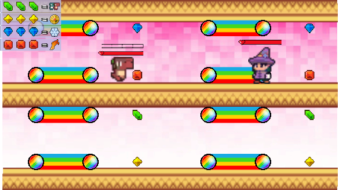

# CSCI526 Music Warrior

Experienced the whole lifecycle of game development: sktech -> prototype -> develop <-> improve <-> playetest -> publish -> demo.

The final product is a combination of 2D platformer & rhythm game.

Codebase [here](https://github.com/Blazar221/DeadlineForce).
## 1. Getting Started
Install Unity 2021.3.8, run

## 2. Technologies
Unity, C#

## 3. Result
 - [doc](https://docs.google.com/document/d/12nChYzMglIX_hkd0Y7s8LkITmnToriefRo5TWD6ynmY/edit)
 - [2/3 progress gameplay](https://youtu.be/8x9n3zTv5Cw)
 - [final gameplay](https://youtu.be/s920mRaYSzw)
 - [presentation](https://youtu.be/sr4M-TqihWc) (onsite short talk as dub)
 - [my practice playtest](https://youtu.be/8WFzI5K_Vv4)
 
