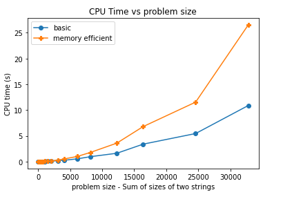
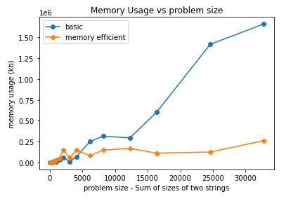

# CSCI-570 Dynamic Programming with Divide & Conquer
Solve sequence alignment problem with plain dynamic programming and that with divide & conquer, experiment with different input size and compare time and memory usage of the 2. Edit distance given in the pdf.

## 1. Getting Started
copy a .txt from testcases/ to this dir, run basic.sh/efficient.sh to get result for plain dynamic programming / dynamic programming with divide & conquer respectivel

## 2. Technologies
Java, python

## 3. Result
in output.txt, first 2 lines are alignment solution with min cost (only showing first 50 and last 50 chars); 3rd line is edit distance; 4th line is memory usage; 5th line is time usage.

Time v.s input size:

Memory usage v.s input size:

summeries given in Summary.txt